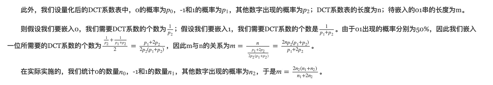
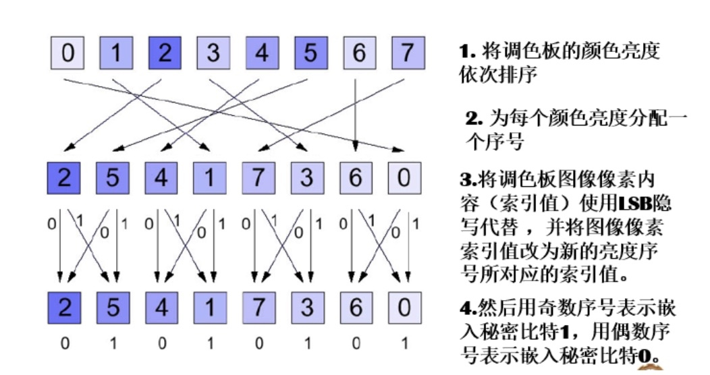
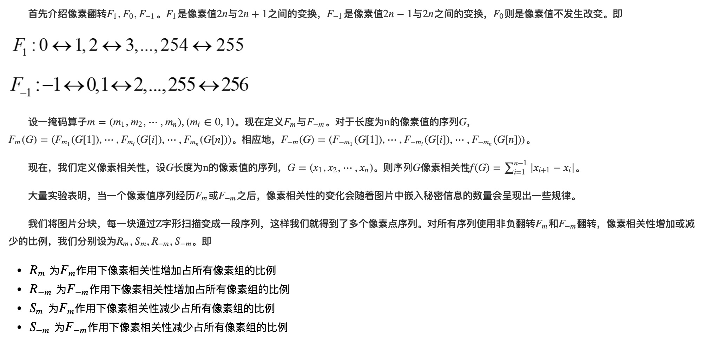
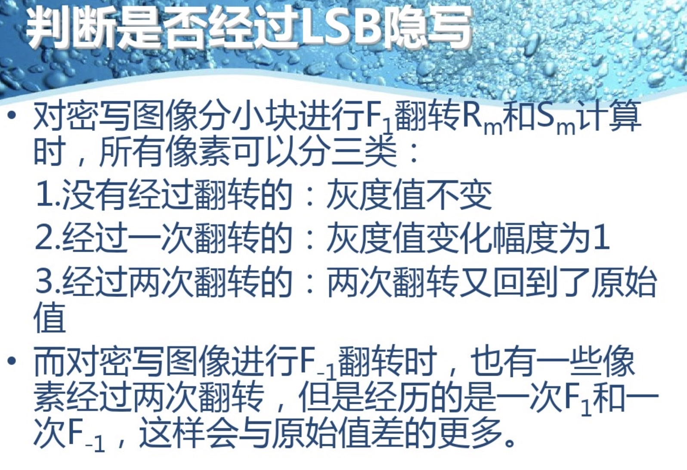
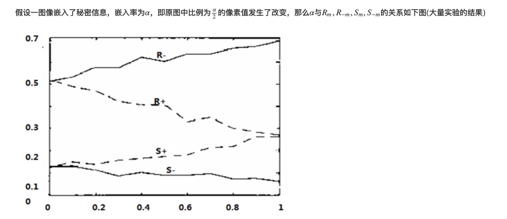
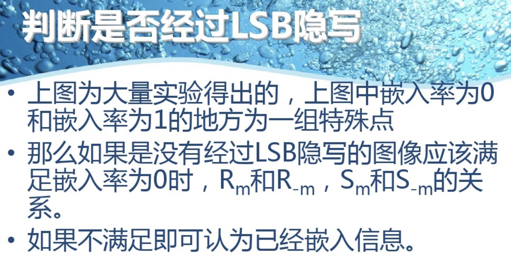
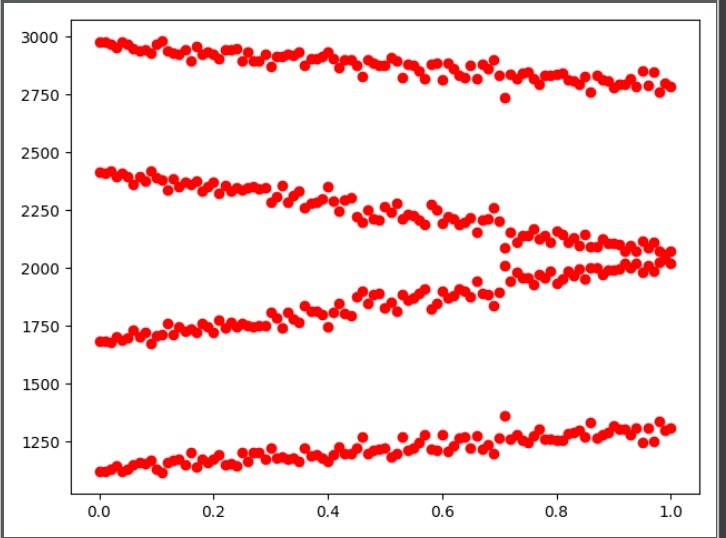
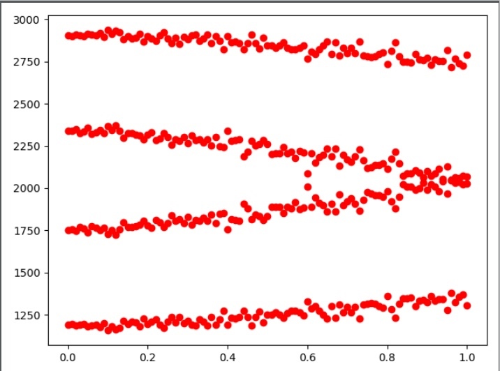

# 数字隐写
## LSB隐写
* LSB隐写是最基础、最简单的隐写方法，具有容量大、嵌入速度快、对载体图像质量影响小的特点。
* LSB的大意就是最低比特位隐写。我们将深度为8的BMP图像，分为8个二值平面（位平面），我们将待嵌入的信息（info）直接写到最低的位平面上。换句话说，如果秘密信息与最低比特位相同，则不改动；如果秘密信息与最低比特位不同，则使用秘密信息值代替最低比特位。
　　
* 实现: GUI.....

-------

## 面向JPEG的彩色图片隐写：Jsteg隐写(彩色三信道的)

### requirement
Python 3
Pillow (PIL fork) 

-------

### Encode
- 输入 : 一张彩色图片 , 要隐写的文字(英文, 中文等)
- 输出 : 一张隐写的图片


#### Example of embedding text in an image
```python
python main.py sample-pics/cat1.jpg -e "写入的内容"
```

-------

### Decode
- 输入 : 隐写的图片
- 输出 : 隐写的文字


#### Example of decoding text from an image
```python
python main.py output.png -d
```

* 实现: 文件夹(Jsteg(彩色))
-------

## 面向JPEG的图像隐写（2）：F3隐写
* 在Jsetg隐写方法中，原始值为-1，0，+1的DCT系数，不负载秘密信息，但是量化后的DCT系数中却有大量的-1，0，+1（以0居多），这说明Jsetg的嵌入率会很小。为了改善这一状况，人们提出了F3隐写。

* F3则对原始值为+1和-1的DCT系数，进行了利用。F3隐写的规则如下:
    (1) 每个非0的DCT数据用于隐藏1比特秘密信息，为0的DCT系数不负载秘密信息。
(2) 如果秘密信息与DCT的LSB相同，便不作改动；如果不同，将DCT系数的绝对值减小1，符号不变。
(3) 当原始值为+1或-1且预嵌入秘密信息为0时，将这个位置归0并视为无效，在下一个DCT系数上重新嵌入。

#### Decode and Encode


* 可嵌入容量的计算

　　这里需要说的是，由于F3隐写特殊的规则，我们无法精确得到可嵌入的信息的容量，我们只能得到最小值，即原始值为非0，-1，+1的像素点的数量。但是，我们可以得到一个数学期望。但是这个期望等于多少呢？我们来算一下。

　　为了严谨性，我们先列出几条假设：

    (1) 待嵌入信息为01串。在此01串中，0和1随机均匀分布，且0和1出现的概率分别为50%。
    (2) 假设系数表中不同系数的出现是随机的，我们忽略它们出现的次序，如非0、-1、+1的出现总是相邻的。
　　

## 调色板隐写(EZStego隐写)

**调色板隐写(EZStego隐写)**
调色板图像是互联网上常见的一种图像格式，其中含有一个不超过256种颜色的调色板，并定义了每种颜色对应的R,G,B各颜色分量值，图像内容中的每个像素是不超过8比特信息的一个索引值，其指向的调色板中的对应颜色即该像素中的真实颜色。常见的调色板图像格式是GIF,PNG。
**EZStego隐写**
- (1) 将调色板的颜色亮度依次排序，其中颜色的亮度由不同的颜色分量线性叠加而成，其表达式为Y=0.299R+0.587G+0.114B。
- (2) 为每个颜色分配一个亮度序号。
- (3) 将调色板图像像素内容使用LSB隐写代替，并将图像像素索引值改为新的亮度序号所对用的索引值。
- (4) 用奇数序号表示嵌入秘密比特1，用偶数序号表示嵌入秘密比特0。



实现:EZStego隐写.py
-------

## 隐写的发现与分析(RS分析)
最后介绍一下嵌入率和四个指标之间的关系,发现隐写嵌入率和这几个像素变化的关系,进而发现是否隐写.
一种判断图片是否隐写的方法,以及得到其隐写的嵌入率






实现:RS分析.py
拿第一个试验前后的照片为例(6.bmp)
结果:
嵌入前 RS 分析(6-bmp):


嵌入少量信息后(6-mod.bmp):


结果分析:通过分析我们发现,嵌入少量信息(123455)后,其 R+和 S+曲线有像中心偏移的趋势,说明可能存在文字的嵌入